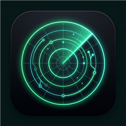
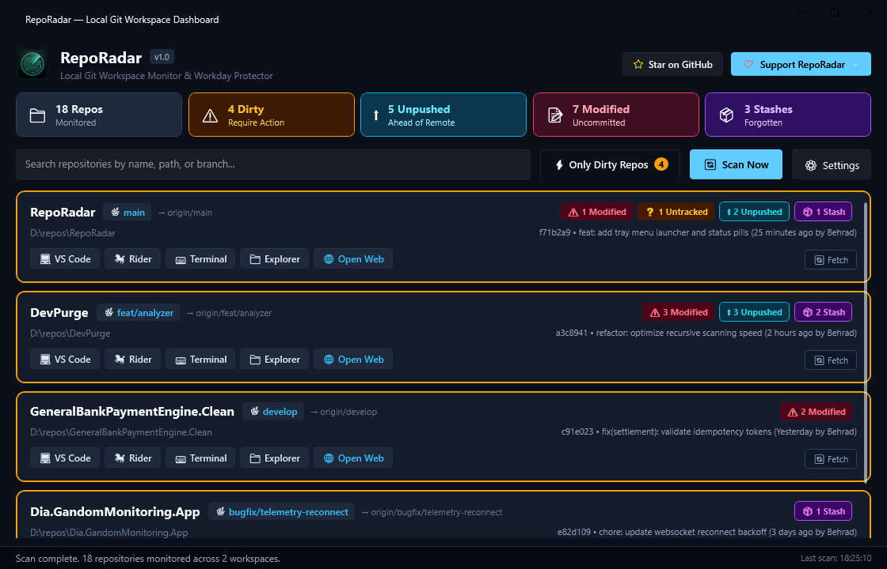
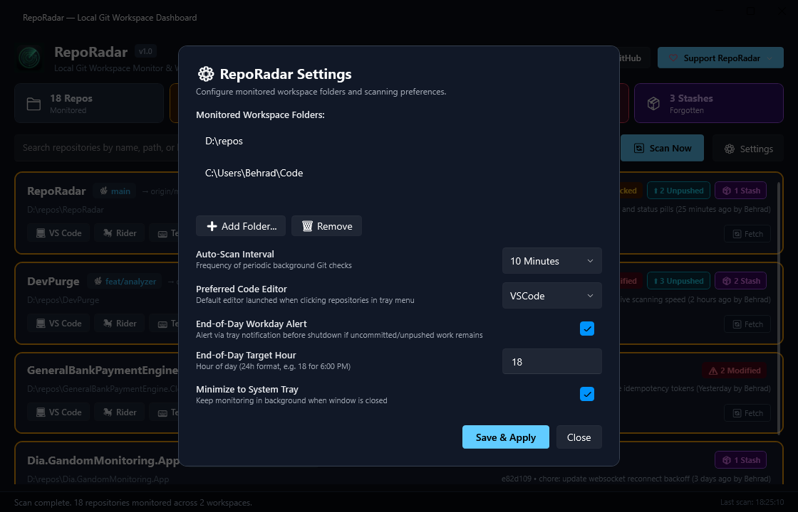
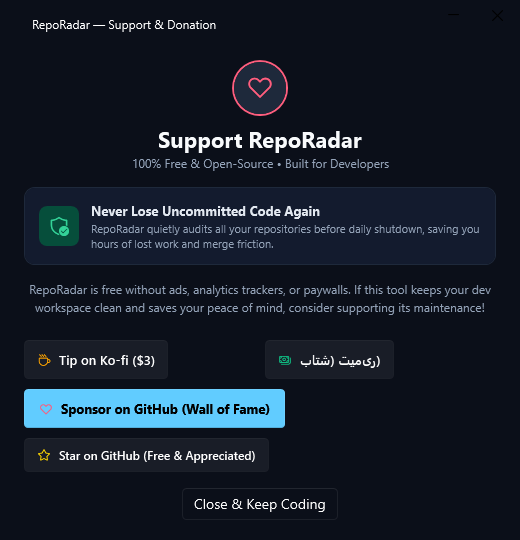

<div align="center">



# RepoRadar

### Local Git Workspace Dashboard & Workday Protector

[](LICENSE)
[](https://dotnet.microsoft.com/)
[](https://microsoft.com/windows)
[](https://github.com/lepoco/wpfui)
[]()
[](https://github.com/sponsors/Behrad87)
[](https://ko-fi.com/behrad87)
[-00C853?logo=cashapp&logoColor=white)](https://reymit.ir/behrad87)

**A system tray widget and desktop dashboard that monitors all your local Git projects and alerts you to uncommitted changes, unpushed commits, and forgotten stashes before you finish your workday.**

<br />



</div>

---

## 🎯 The Problem

Developers and engineers who work across **10–30 local repositories simultaneously** often shut down their laptop at the end of the day or switch machines, only to realize later that they:
- Forgot to `git push` critical commits before closing.
- Left half-finished modifications uncommitted on an experimental branch.
- Left forgotten stashes that block team members or pull requests.

**RepoRadar** solves this by living quietly in your system tray, periodically auditing your workspace in the background, and proactively alerting you before your workday ends.

---

## ✨ Features

- 📡 **Multi-Workspace Folder Monitoring**: Point RepoRadar to `D:\repos`, `~/Code`, or any development directory. It automatically and recursively discovers all `.git` repositories while ignoring build clutter (`node_modules`, `bin`, `obj`, `.vs`).
- ⚡ **"Only Dirty Repos" Triage View**: Toggle with a single click to hide clean repositories and zero in on only the projects that require immediate action.
- 📊 **Real-Time Git Metrics**:
  - ⚠️ **Uncommitted Changes**: Staged and unstaged modifications count.
  - ❓ **Untracked Files**: Newly created files not yet tracked.
  - ⬆️ **Unpushed Commits**: Commits ahead of upstream remote.
  - ⬇️ **Behind Remote**: Commits waiting to be pulled from upstream.
  - 📦 **Forgotten Stashes**: Stashes saved and left behind.
- 💻 **1-Click IDE & Tool Launchers**: Open any repository directly in:
  - **VS Code** (`code <path>`)
  - **JetBrains Rider** (`rider <path>`)
  - **Windows Terminal** (`wt -d <path>`)
  - **File Explorer** (`explorer.exe <path>`)
  - **Remote Web Repository** (GitHub / GitLab in your default browser)
- 🔔 **System Tray Widget & Quick Menu**:
  - Tray icon reflects current workspace status.
  - Context menu lists dirty repositories with one-click editor launch directly from the taskbar.
  - Minimizes to tray to stay out of your way.
- ⏰ **End-of-Day Git Alert**: Configurable daily reminder (e.g. 18:00 / 6:00 PM) that triggers a notification if any unpushed or uncommitted work is detected.
- ⚡ **Blazing Fast Scanning**: Uses parallel asynchronous `git status --porcelain=v2 --branch` execution. Auditing 30+ repositories takes only a fraction of a second.

---

## 🖥️ Visual Showcase

<div align="center">

### Modern Fluent Dark Dashboard


<br /><br />

### Monitored Workspaces & Auto-Scan Settings


<br /><br />

### Developer Support & Donation Dialog


</div>

---

## 🏗️ Architecture & Tech Stack

RepoRadar is engineered using a clean, decoupled architecture:

```
RepoRadar/
├── src/
│   ├── RepoRadar.Core/          # Standalone business logic and Git engine
│   │   ├── Models/              # GitRepositoryInfo, WorkspaceSettings, ScanStatistics
│   │   └── Services/            # IGitScannerService, IGitProcessRunner, IGitParser,
│   │                            # ISettingsService, ILauncherService
│   │
│   └── RepoRadar.App/           # Windows 11 Fluent UI (WPF-UI 4.3 + MVVM)
│       ├── Views/               # MainWindow.xaml, TitleBar, Cards, Dialogs
│       ├── ViewModels/          # MainViewModel, RepoItemViewModel, SettingsViewModel
│       ├── Converters/          # UI status and color converters
│       └── Services/            # TrayIconManager (NotifyIcon integration)
│
└── tests/
    └── RepoRadar.Tests/         # Comprehensive xUnit automated test suite
```

### Git Execution Engine
Unlike heavy wrappers that rely on native C binaries (`LibGit2Sharp`), RepoRadar executes lightweight `git status --porcelain=v2 --branch` directly via `System.Diagnostics.Process`:
1. **Zero DLL Incompatibilities**: Runs smoothly on any CPU architecture without native dependency issues.
2. **Respects Your Git Setup**: Automatically honors your global `.gitconfig`, SSH keys, GPG signing, and `.gitignore`.
3. **Machine-Readable V2 Porcelain**: Parses branch state, ahead/behind counters, and modification types with zero ambiguity.

---

## 🚀 Quick Start

### Prerequisites
- [.NET 10 SDK](https://dotnet.microsoft.com/download) (or .NET 8 / 9)
- [Git for Windows](https://git-scm.com/) installed and available in your `PATH`

### 1. Clone & Build
```bash
git clone https://github.com/Behrad87/RepoRadar.git
cd RepoRadar
dotnet build
```

### 2. Run Tests
```bash
dotnet test
```

### 3. Run Application
```bash
dotnet run --project src/RepoRadar.App/RepoRadar.App.csproj
```

### 4. Publish Single-File Executable
```bash
dotnet publish src/RepoRadar.App/RepoRadar.App.csproj -c Release -r win-x64 --self-contained true -p:PublishSingleFile=true -o ./release
```

---

## ⚙️ Configuration

Settings are saved in `%APPDATA%\RepoRadar\config.json`:

```json
{
  "WorkspaceFolders": [
    "D:\\repos",
    "C:\\Users\\Behrad\\Code"
  ],
  "ScanIntervalMinutes": 10,
  "AutoScanEnabled": true,
  "MaxScanDepth": 3,
  "FilterOnlyDirty": true,
  "CloseToTray": true,
  "StartMinimized": false,
  "NotifyOnDirtyBeforeEndOfDay": true,
  "EndOfDayHour": 18,
  "PreferredEditor": 0
}
```

---

## 🧪 Test Suite

The test suite in `tests/RepoRadar.Tests` validates:
- Git status porcelain v2 parser with clean, modified, staged, renamed, untracked, and conflict states.
- Ahead/Behind tracking and stash counter parser.
- SSH / HTTPS remote URL normalizer for browser links.
- Directory discovery ignore rules (`node_modules`, `bin`, `obj`).
- Settings persistence and serialization.

Run all tests:
```powershell
dotnet test
```

---

## 💖 Support the Project & Donate

### 💡 The Value Trade-off
Losing half a day of unsaved code, uncommitted hotfixes, or tracking down branch merge conflicts because you switched machines or closed your laptop without pushing easily costs hundreds of dollars in lost engineering time.

**RepoRadar is 100% free, forever, with zero ads, zero paywalls, and zero telemetry.**

If RepoRadar quietly saved your workday from lost code or keeps your multi-repo workspace clean and organized, please consider buying the developer a coffee or sponsoring the project!

### 🌍 Ways to Support

| Platform | Best For | Link |
| :--- | :--- | :--- |
| **GitHub Sponsors** | Recurring or one-time international support (Wall of Fame) | [💖 Sponsor @Behrad87](https://github.com/sponsors/Behrad87) |
| **Ko-fi** | Quick one-time coffee / tip via Card or PayPal ($3) | [☕ Tip on Ko-fi](https://ko-fi.com/behrad87) |
| **Reymit (Iran / ری‌میت)** | پرداخت ریالی و آنی از داخل ایران با کلیه کارت‌های عضو شتاب | [🇮🇷 حمایت از طریق ری‌میت](https://reymit.ir/behrad87) |

---

## 🤝 Contributing

Contributions, issues, and feature requests are welcome! Feel free to check the [issues page](https://github.com/Behrad87/RepoRadar/issues).

1. Fork the Project
2. Create your Feature Branch (`git checkout -b feature/AmazingFeature`)
3. Commit your Changes (`git commit -m 'feat: add some AmazingFeature'`)
4. Push to the Branch (`git push origin feature/AmazingFeature`)
5. Open a Pull Request

---

## 📄 License

Distributed under the MIT License. See [`LICENSE`](LICENSE) for details.

Developed with ❤️ by [Behrad Zarei (Behrad87)](https://github.com/Behrad87).
